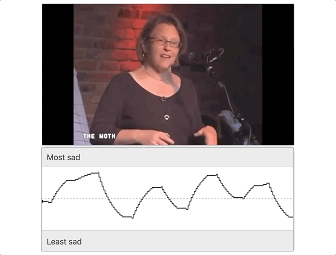

# continuous-rater

[](https://doi.org/10.5281/zenodo.4279654)

For an in-depth tutorial and more information, please visit [maxfarrens.github.io/continuous-rater-book](https://maxfarrens.github.io/continuous-rater-book/). Visit [continuous-rater-demo.netlify.app](https://continuous-rater-demo.netlify.app/) to play with a pre-configured demo. Here is a gif of the app in action:




## <a name=about></a>about
`continuous-rater` is **an app that allows participants to continuously rate their emotions while viewing a video stimulus**. It is compatible with Amazon Mechanical Turk. This app requires some configuration before use: click [here](https://maxfarrens.github.io/continuous-rater-book/) for more information.

app built by Max Farrens and [COSAN Lab](https://cosanlab.com/).
## <a name=getting_started></a>getting started

1. If you do not already have it, install [Node.js](https://nodejs.org/en/)

2. Clone the repository locally. Go to your command line and enter:

	```
	git clone https://github.com/maxfarrens/continuous-rater.git
	```
3. Install the dependencies using npm (from within the local repository):

	```
	cd continuous-rater
	npm install
	```
4. Start Rollup:

	```
	npm run dev
	```
5. Navigate to [localhost:5000](localhost:5000) in your browser of choice. You should see a developer version of your app running. **Initially, it should just display a white screen with no content**. In order to make the app functional for your experiment, you need to set up and link a Firebase backend, and edit some variables in the `src/utils.js` file within the `continuous-rater` repository. This is all explained at [maxfarrens.github.io/continuous-rater-book](https://maxfarrens.github.io/continuous-rater-book/).
  


## <a name=contact></a>contact

please email [Max](mailto:maxfarrens@gmail.com) or [COSAN Lab](mailto:cosanlab@gmail.com) with any questions or issues. Thanks!
	
