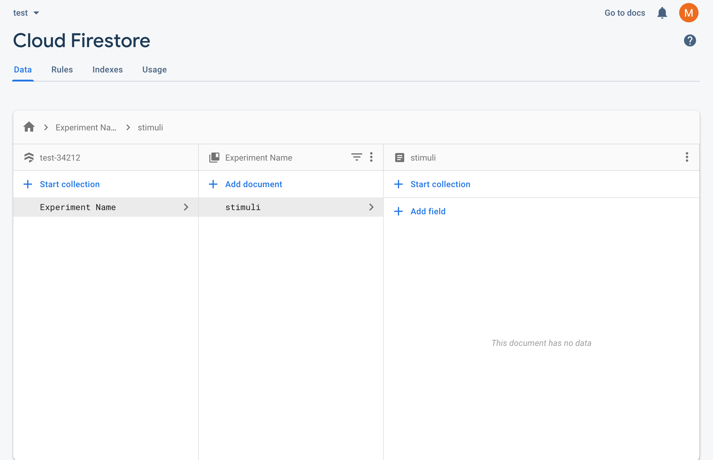
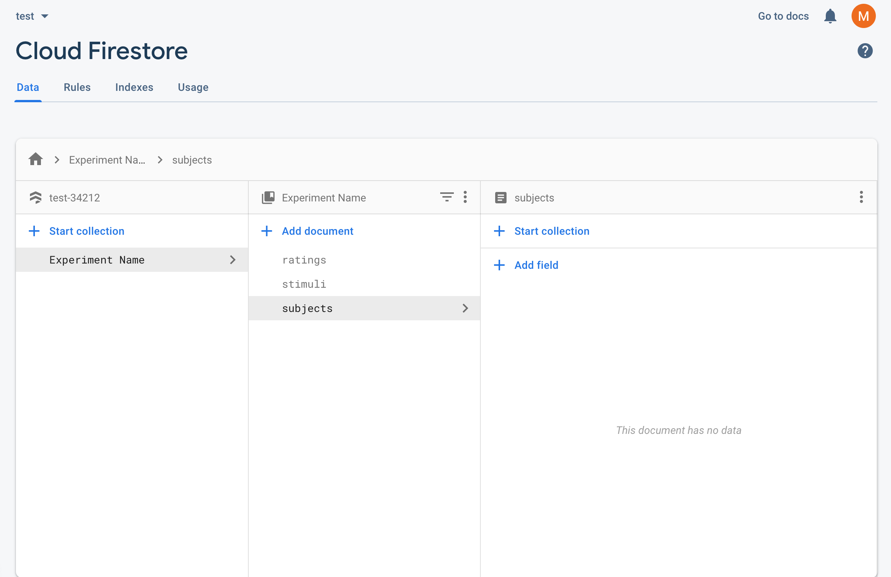
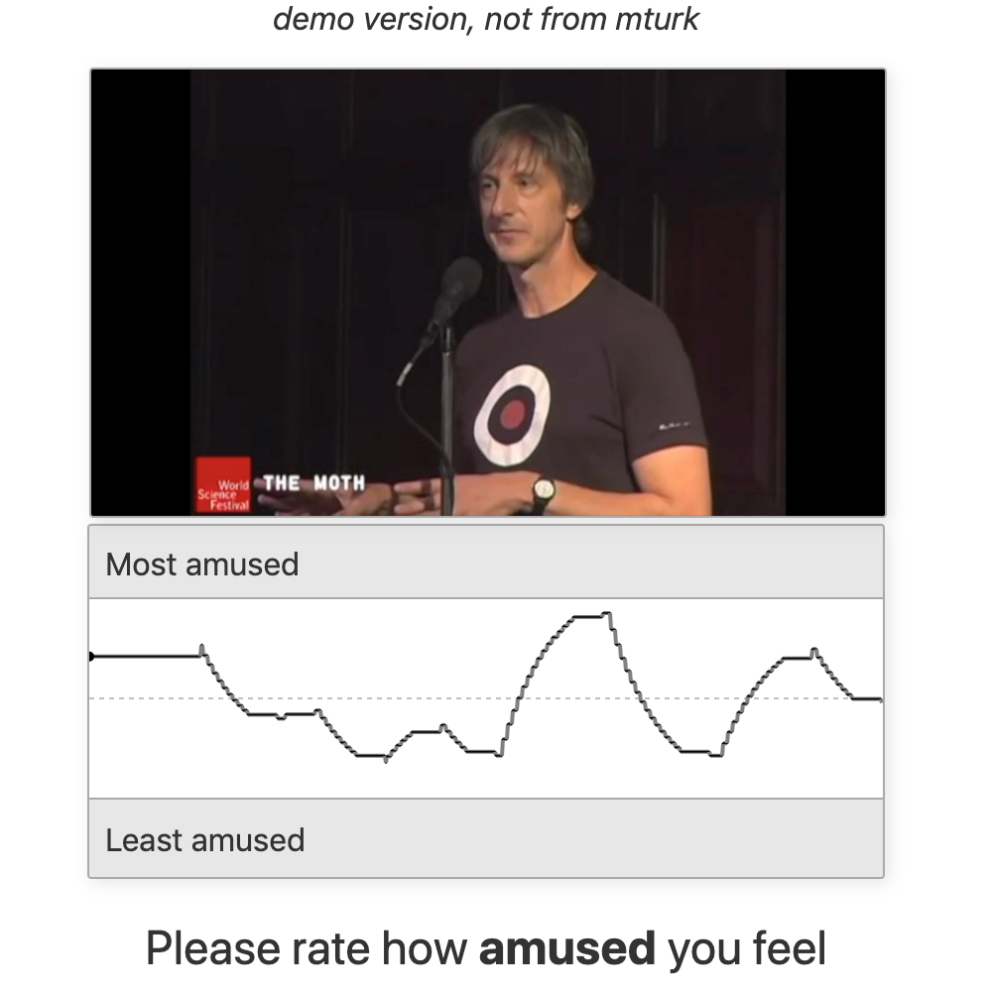

# continuous-rater
app by Max Farrens and COSAN Lab. Visit this [site](https://focused-hugle-d6df19.netlify.app) for a pre-configured demo. See [below](#demo_screenshot) for a screenshot of the app in action.

---
## <a name=about></a>about
continuous-rater is <strong>an app that allows participants to continuously rate their emotions while viewing a stimulus</strong>. It uses Firebase as its database, and can be used either locally (in a lab), or online (via Amazon Mechanical Turk). Using this app for your own experiment requires some configuration (both of the app itself, and of other web services like Firebase), but I have included instructions for all necessary steps in this README.

## <a name=getting_started></a>getting started

1. If you do not already have it, install [Node.js](https://nodejs.org/en/)

2. Clone the repository locally. Go to your command line and enter:

	```
	git clone https://github.com/maxfarrens/continuous-rater.git
	```
3. Install the dependencies using npm:

	```
	cd continuous-rater
	npm install
	```
4. Start Rollup:

	```
	npm run dev
	```
5. Navigate to [localhost:5000](localhost:5000) in your browser of choice (this app works best in Chrome). You should see a developer version of your app running. Initially, it should just display a white screen with text that says ***demo version, not from mturk***. In order to make the app functional for your experiment, you need to set up and link a Firebase backend, and edit some variables in the `src/utils.js` file in the `continuous-rater` repository. This is all explained below. Read on! 


## <a name=firebase_backend></a>firebase backend
continuous-rater relies on Google Firebase to store and access information about subjects, ratings and stimuli. Firebase offers a generous free tier and is cost-effective to scale-up. To get started, click [here](https://console.firebase.google.com/) to go to the Firebase console and sign in with a Google account. Here's how you get set up:

1. Press the <strong>Create a project</strong> button and follow the prompts until your project is initialized (I recommend the default options provided).


2. Open your new project and click the <strong>Develop</strong> tab in the left-side menu.


3. Under <strong>Develop</strong>, click **Authentication** and then navigate to the **Sign-in method** tab.


4. Edit the **Email/Password** option and toggle the top **Enable** switch to on. Press **Save**.


5. Back under the **Develop** tab, click **Cloud Firestore** and then click the **Create database** button. Change the security rules option to **Start in test mode** and press **Next**. Keep the default location, and then press **Enable**.


6. After a brief loading period, you should see your Cloud Firestore database! Start by navigating to the **Rules** tab right under Cloud Firestore. Copy and paste the following code over the current rules, and then press **Publish**.
	
	```
	rules_version = '2';
	service cloud.firestore {
 		match /databases/{database}/documents {
    		match /{document=**} {
      			allow read, write: if request.auth.uid != null
    		}
  		}
	}
	```
7. Navigate back to the **Data** tab (directly left of **Rules**) within Cloud Firestore and press **+ Start collection**. Name this collection with the name of your experiment. When prompted to add a document, provide 'stimuli' as the **Document ID** (IMPT: must be exact, case-sensitive). Do not provide a field. Press **Save**. You should now have a Firestore that looks similar to this:

	

8. Using the **+ Add document** button (located directly above the 'stimuli' document), add one document with the ID 'ratings' and another document with the ID 'subjects' (IMPT: again, must be exact, case-sensitive). Your Firestore should now look like this:

	
	
9. Now, you need to create a table for your stimuli (this is not where the stimuli are served, but where their urls are stored). Click on the 'stimuli' document that you created earlier. On the right-most column, press **+ Add field**. Under the **Field** category, input the name of one stimulus (IMPT: this name cannot include hyphens) and under the **Value** category, input the URL for that stimulus (e.g. Name: CopsDontCry, Field: [https://dfhda873u.cloudfront.net/CopsDontCry.mp4]()). Then, press **Add**. Repeat this step for all stimuli used in the experiment. For information on how to best serve audio/video stimuli, see the [serving stimuli](#serve-stim) section below.

10. <a name="firebase-config"></a>Finally, navigate to **Settings** by clicking the gear icon next to **Project Overview** in the left-hand menu, and then pressing **Project settings**. In the **General** tab, scroll down and click the blue circular HTML icon (< / >). Nickname your app with the name of your experiment, but do not add Firebase Hosting. Press **Register app**. When you get to **Add Firebase SDK**, DO NOT copy and paste the provided scripts into your app. Instead, press **Continue to console**. Then, under the **Firebase SDK snippet**, select **Config** (instead of **CDN**), and copy/paste that code snippet somewhere easy to access. You will use it later to configure the `src/utils.js` file that connects your app to your Firebase.

11. Once you complete these steps, your backend is set up! If you run out of read/write capacity within Firestore on the stock free plan, you can upgrade to a paid version. See details [here](https://firebase.google.com/pricing?authuser=0).


## <a name="serve-stim"></a> serving stimuli
this app requires stimuli to be served (either on a local server or using a web-service like AWS). I recommend against serving stimuli on a local server due to issues surrounding reliability/scalability (but, this app will still function if you choose to do so). I also recommend against using Firebase to store and serve audio/video stimuli due to problematic latency issues (again, the app will still function if you choose to do so). **I used [AWS S3](https://aws.amazon.com/s3/) to store my videos and [AWS CloudFront](https://aws.amazon.com/cloudfront/) (CDN) to deliver my content to end-users**. Basically, all you have to do is create an S3 storage bucket, dump your videos into that bucket and then create a CloudFront distribution that points to that bucket. Read the docs ([S3](https://docs.aws.amazon.com/AmazonS3/latest/gsg/GetStartedWithS3.html) and [CloudFront](https://docs.aws.amazon.com/AmazonCloudFront/latest/DeveloperGuide/Introduction.html)) to get started. Click [here](https://aws.amazon.com/cloudfront/streaming/) for a helpful Amazon tutorial on streaming video. 

Some quick tips:


1. **Lower resolution = better streaming**. I recommend converting all videos to 480p and .mp4 format for optimal streaming (unless resolution is important to your study). You can either do this locally, or use [AWS MediaConvert](https://aws.amazon.com/mediaconvert/) to convert videos already uploaded to S3 storage (make sure your CDN points to these converted videos, not the originals!).


2. **Name your files as simply as possible**. For example, I used a video called **Cops Don't Cry** and named the file **CopsDontCry.mp4**, removing all special characters and spaces. You will need to use these exact names in your Firebase database, so simpler is better. 

3. **Check your files permissions**. If using AWS S3, ensure that the storage bucket containing your media (as well as the media itself) allows the necessary read access permissions, otherwise your CDN will not be able to serve your stimuli.

3. **Validate streaming functionality early**. You can check to ensure your streaming is working by appending a stimulus filename to the host or CDN url. Use this url to watch the clip directly in your browser. For example, if my CDN is [https://dfhda873u.cloudfront.net/]() and my video is CopsDontCry.mp4, then I can test my distribution chain using [https://dfhda873u.cloudfront.net/CopsDontCry.mp4](). Once validated, add your stimuli to the stimuli table in Firebase by providing name/url pairings (e.g. CopsDontCry in the Field category and [https://dfhda873u.cloudfront.net/CopsDontCry.mp4]() in the Value category). 


## <a name=customizing_the_code></a>customizing the code
this app has been configured to require minimal coding to repurpose. To customize the app for your needs, simply open `src/utils.js` in the `continuous-rater` folder, and edit it in the text editor of your choosing. There are several sections (clearly labeled in the file) that need attention. When filling in these variables, make sure to **pay attention to the language provided in the examples, and format your information in the same way**.

1. <strong>Lab variables</strong>

	* `studyLocation` -- physical location of your lab/group (e.g., the PBS Department at Dartmouth College

	* `labName` -- the name of your lab/group (e.g., COSAN Lab)

	* `email` -- the best email address for participants to use to contact you with questions/concerns
	
	* `studyAim` -- the main goal of the mturk study (e.g., to better understand emotional responses to videos)

	* `studyTasks` -- brief summary of task for inclusion in consent form... NOT full instructions (e.g., watching and rating short videos)

	* `experiment` -- the name of your experiment (which should match the name of your outermost collection in Firebase, the one you made first)

2. <strong>HIT variables</strong>
	
	* `buildVer` -- the version of the code currently being run. This should be 'demo' if attempting to run standalone (for debugging or use outside of mturk), 'sandbox' if testing with mturk sandbox and 'build' if ready for real HITs in mturk

	* `HITPay` -- compensation for completion of task. Format as X.XX (e.g., 2.50), and do not include a $ symbol

	* `userGroup` -- name of Firebase collection of participants for current task. Can be whatever you want(e.g., MTurk Group)

	* `estHITTime` -- estimated time it should take workers to complete task (in minutes; e.g., 5)

	

3. <strong>Stimuli variables</strong>

	* `ratingTypes` -- a list of the types of ratings you are interested in receiving. Each rating should be enclosed in single quotes (e.g., ['amused', 'afraid'] ) and can be as long or short as you like


4. <strong>Firebase variables</strong>

	```javascript
	const firebaseConfig = {
	    apiKey: "",
	    authDomain: "",
	    databaseURL: "",
	    projectId: "",
	    storageBucket: "",
	    messagingSenderId: "",
	    appId: "",
	    measurementId: ""
	};
	```

	The above configuration information can be accessed via the Firebase console (**you already saved this code snippet locally in [step 10](#firebase-config) of the Firebase instructions above**) inside a Firebase project you have started. Copy and paste your unique config information over this blank one in the file.
	
Once this file has been successfully edited, save it, and navigate back to [localhost:5000](localhost:5000) in your browser (Rollup still has to be running... if it's not, revisit the **[getting started](#getting_started)** section above for instructions on how to display your web app). You should now see your functioning web app!

## <a name=contact></a>contact

please email [Max](mailto:maxfarrens@gmail.com) or [COSAN Lab](cosanlab@gmail.com) with any questions or issues. Thanks!
	
	
## <a name=demo_screenshot></a> screenshot




